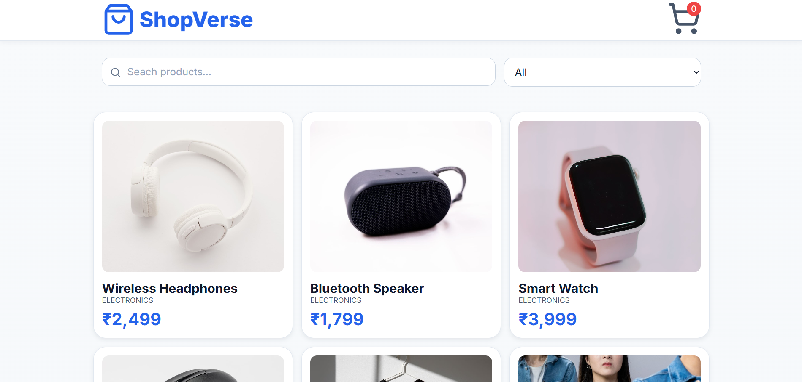
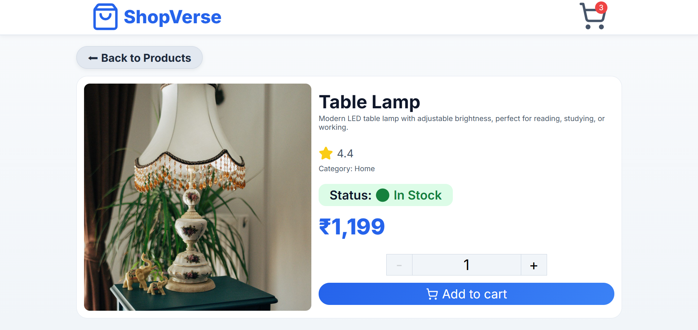
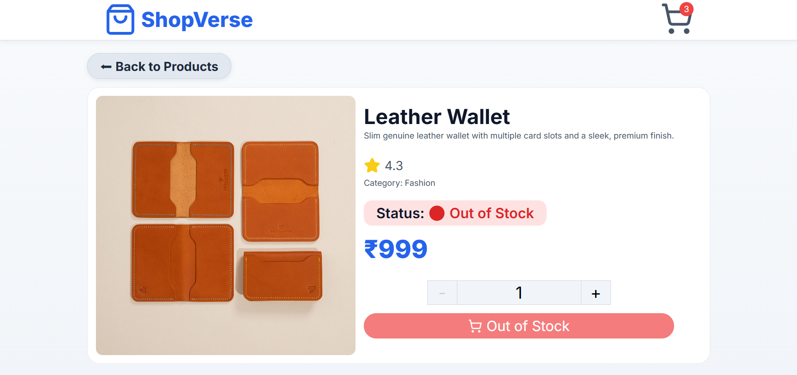
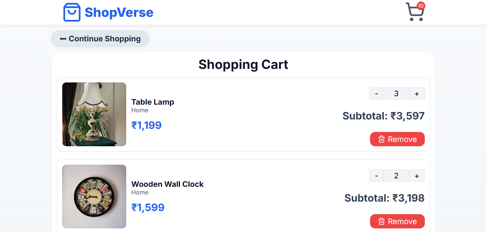
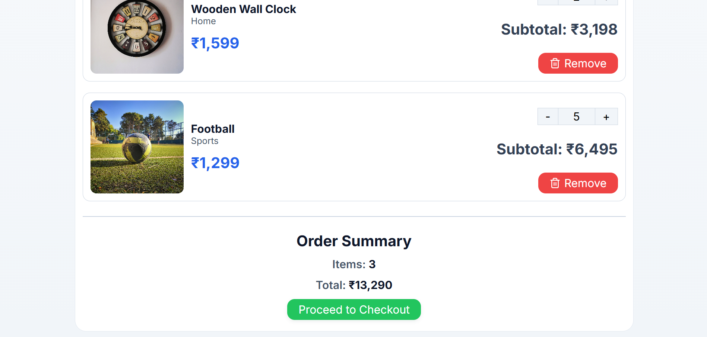
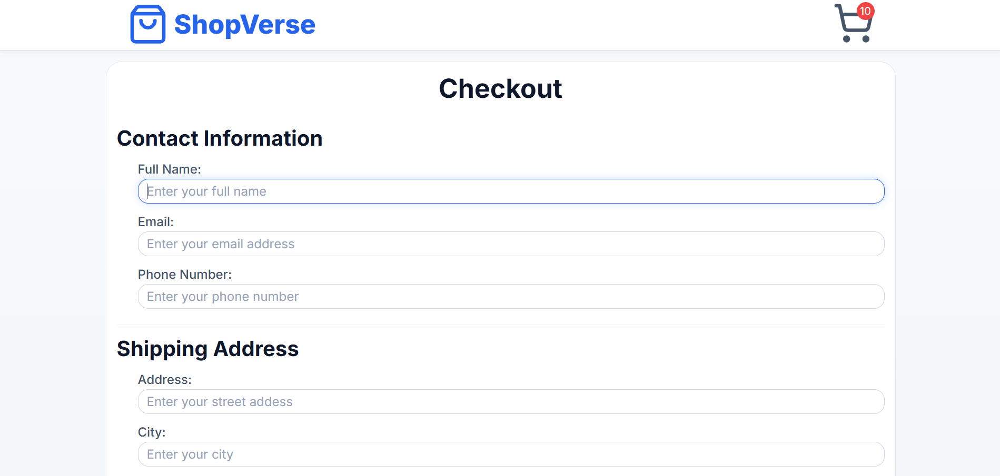
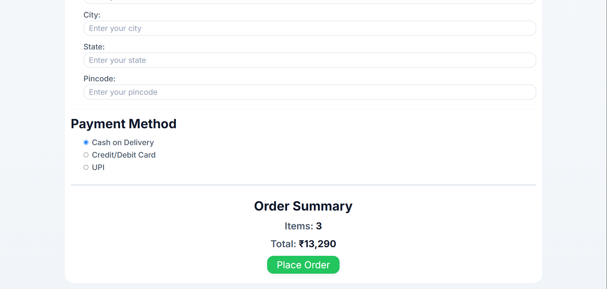
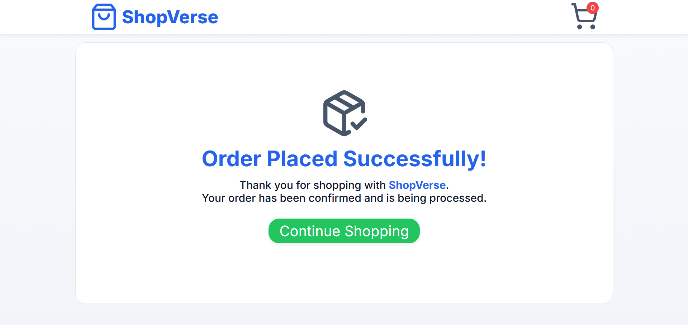

# 🛍️ ShopVerse

A modern and responsive e-commerce web application built with **React**. ShopVerse allows users to browse products, search and filter items, view detailed product information, manage a shopping cart, and complete a simulated checkout experience.

Designed with a clean UI, reusable React components, and Context API for global state management, this project demonstrates practical front-end development skills using modern React.

---

🌐 Live Demo

🔗 Live Website: https://shopverse-yash.netlify.app/

---

## 📸 Preview

### Home Page


### Product Details



### Shopping Cart



### Checkout



### Order Success


---

## ✨ Features

### 🛒 Shopping Experience

* Browse products in a responsive product grid
* View detailed product information
* Add products to the shopping cart
* Increase or decrease product quantity
* Remove items from the cart
* Automatic subtotal and total price calculation
* Cart badge showing total quantity of items

### 🔍 Search & Filtering

* Search products by name
* Filter products by category
* Search and selected category are preserved using Session Storage

### 💾 Persistent Cart

* Cart data is saved in Local Storage
* Cart remains available after refreshing the page

### 📦 Checkout Flow

* Checkout page with contact information
* Shipping address section
* Payment method selection
* Order summary
* Order success page
* Empty cart page

### 🎨 User Interface

* Fully responsive layout
* Modern blue-themed design
* Smooth hover animations and transitions
* Clean card-based interface
* Reusable components
* Consistent design system using CSS variables

---

## 🛠️ Built With

* React
* React Router DOM
* Context API
* JavaScript (ES6+)
* CSS3
* Vite
* Lucide React Icons

---

## 📁 Project Structure

```text
src/
│
├── assets/
├── components/
│   ├── CartItem
│   ├── CategoryFilter
│   ├── EmptyCart
│   ├── NavBar
│   ├── OrderSummary
│   ├── ProductCard
│   ├── ProductsGrid
│   └── SearchBar
│
├── context/
│   └── CartContext
│
├── data/
│   └── products.js
│
├── pages/
│   ├── Home
│   ├── ProductDetails
│   ├── Cart
│   ├── Checkout
│   └── OrderSuccess
│
├── App.jsx
├── main.jsx
└── index.css
```

---

## 🚀 Getting Started

Clone the repository

```bash
git clone https://github.com/your-username/shopverse.git
```

Navigate into the project

```bash
cd shopverse
```

Install dependencies

```bash
npm install
```

Start the development server

```bash
npm run dev
```

Build for production

```bash
npm run build
```

---

## 🧠 Concepts Practiced

* React Components
* Props
* State Management
* Context API
* React Hooks

  * useState
  * useEffect
  * useContext
* React Router
* Conditional Rendering
* Dynamic Lists
* Local Storage
* Session Storage
* Responsive Design
* Component Reusability

---

## 🎯 Future Improvements

* Product sorting
* Product pagination
* Wishlist functionality
* Product ratings and reviews
* Authentication
* Dark mode
* Stock quantity management
* Real payment gateway integration
* Backend API integration

---

## 👨‍💻 Author

**Yash Soni**
